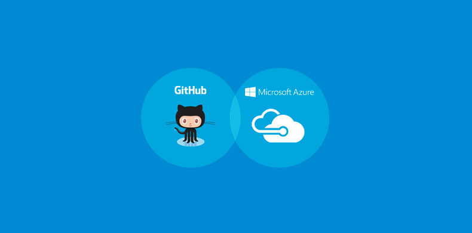

# Lab 0 - Access to Azure and GitHub

In order to successfully complete the remaining labs you need access to an Azure Subscription and a GitHub account. Both are available at no cost.

## GitHub

---

Sign up for a GitHub Account: [https://github.com/join](https://github.com/join)

Additional GitHub Information:

- Configuring Two-Factor Authentication: [https://help.github.com/en/github/setting-up-and-managing-your-github-user-account/managing-user-account-settings](https://help.github.com/en/github/setting-up-and-managing-your-github-user-account/managing-user-account-settings)

- Managing Your User Account: [https://help.github.com/en/github/setting-up-and-managing-your-github-user-account/managing-user-account-settings](https://help.github.com/en/github/setting-up-and-managing-your-github-user-account/managing-user-account-settings)

## Azure

---

Sign up for an Azure Free Account: [https://azure.com/free](https://azure.com/free)

Additional Azure Information:

- Azure Free Account FAQ: [https://azure.microsoft.com/en-us/free/free-account-faq/](https://azure.microsoft.com/en-us/free/free-account-faq/)

- Azure Free Account Offer Details: [https://azure.microsoft.com/en-us/offers/ms-azr-0044p/](https://azure.microsoft.com/en-us/offers/ms-azr-0044p/)

- Azure Free Account Avoiding Charges: [https://docs.microsoft.com/en-us/azure/cost-management-billing/manage/avoid-charges-free-account](https://docs.microsoft.com/en-us/azure/cost-management-billing/manage/avoid-charges-free-account)

---

## Frequently Asked Questions

**Why do I need to provide a credit card and phone number for a Free Azure Account?**

*[From Microsoft FAQ]: One of the ways we keep prices low is to verify that account holders are real people, not bots or anonymous troublemakers. We use the phone number and credit card for identity verification. We don’t charge your credit card anything, but you may see a one-dollar verification hold on your credit card account, which is removed within three to five days.*

**Do I need to use the same email address for my GitHub and Azure Accounts?**

*No, your GitHub and Azure accounts can use different email addresses.*

**Can I use my work email address to sign up for a Free Azure Account?**

*We recommend using a personal email address when signing up for a Free Azure Account. Free Azure trials are limited to one per organization, if another person at your company already utilized the free Azure trial you may have difficulty signing up.*

**Can I use an exising Azure Subscription I have access to?**

*Yes, however you must have Owner rights in the Subscription, and Global Admin rights in the Azure Active Directory Tenant in order to complete the labs. If you are not sure if you have the required permissions we recommend creating a Free Azure Account where you will have these permissions.*

---

