# Lab 1 - Connectivity

- [Create Repo from Template](#Create-Repo-From-Template)
- [Create Azure Service Principal](#Create-Azure-Service-Principal)
- [Create GitHub Credential Variable](#Create-GitHub-Credential-Variable)
- [Configure GitHub Actions](#Configure-GitHub-Actions)
- [Run GitHub Actions](#Run-GitHub-Actions)

---

## Create Repo From Template

1. Access the source repo url: [https://github.com/softchoice-corp/DevOpsBootcamp](https://github.com/softchoice-corp/DevOpsBootcamp)

2. Click the green **Use this template** button. This will copy all of the content from the source repo into a new repo under your GitHub account.

> 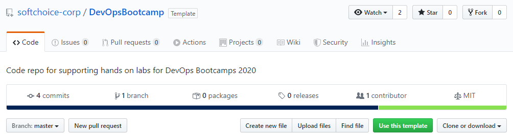

3. Provide a new repository name and description. The repo can be left as `Public`, and leave the `Include all branches` option unselected. Click the green **Create repository from template** button.

> 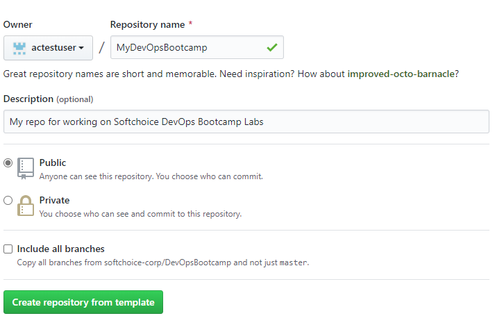

4. Once the repository creation is completed you should see that your new repo is in your account, and was generated from _softchoice-corp/DevOpsBootcamp_.

> 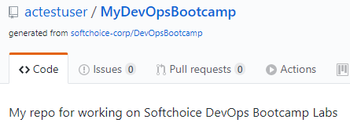

---

## Create Azure Service Principal

We need to create a service principal in Azure that GitHub Actions will use to authenticate and deploy resources.

1. Open the Azure Portal using [https://portal.azure.com](https://portal.azure.com).

> 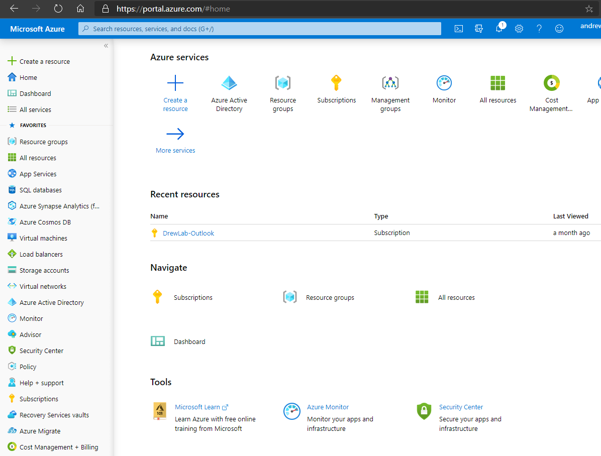

2.Access Cloud Shell from the Azure Portal by clicking the icon in the upper right toolbar.

> 

> Note: If this is the first time you have used Azure Cloud Shell you will be prompted to create a storage account to enable Cloud Shell.

3. Use Azure CLI to create a new service principal for use with GitHub Actions. Az Cli is installed in both PowerShell and Bash within Azure Cloud Shell.

```python
az ad sp create-for-rbac --name GitHubActions
```

Azure will generate a strong password for the service principal and return it in Cloud Shell. We need to capture this information for use in our GitHub secret storage. Example Azure Cloud Shell service principal response:

> 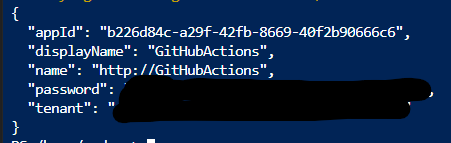

## Create GitHub Credential Variable

---

The JSON properties names returned via Cloud Shell do not exactly match what is required for GitHub Actions. We will need to manually format a JSON object with the required property names.

| GitHub Property Name | Az CLI Property Name |
| -------------------- | -------------------- |
| `clientId`           | `appId`              |
| `clientSecret`       | `password`           |
| `subscriptionId`     | _not provided_       |
| `tenantId`           | `tenant`             |

> Note: Az CLI does not return the Azure Subscription Id in the response when creating a new service principal object. You can obtain this value by using this command: `az account show --query "id"`

1. Copy the JSON code block below, replacing _GUID_ with each value from your Azure environment.

```json
{
  "clientId": "GUID",
  "clientSecret": "GUID",
  "subscriptionId": "GUID",
  "tenantId": "GUID"
}
```

2. In your GitHub Repo navigate to **Settings** > **Secrets**, and click **Add a new Secret**. Name the secret `AZURE_CREDENTIALS`, paste your JSON object in the Value, and click Add Secret. 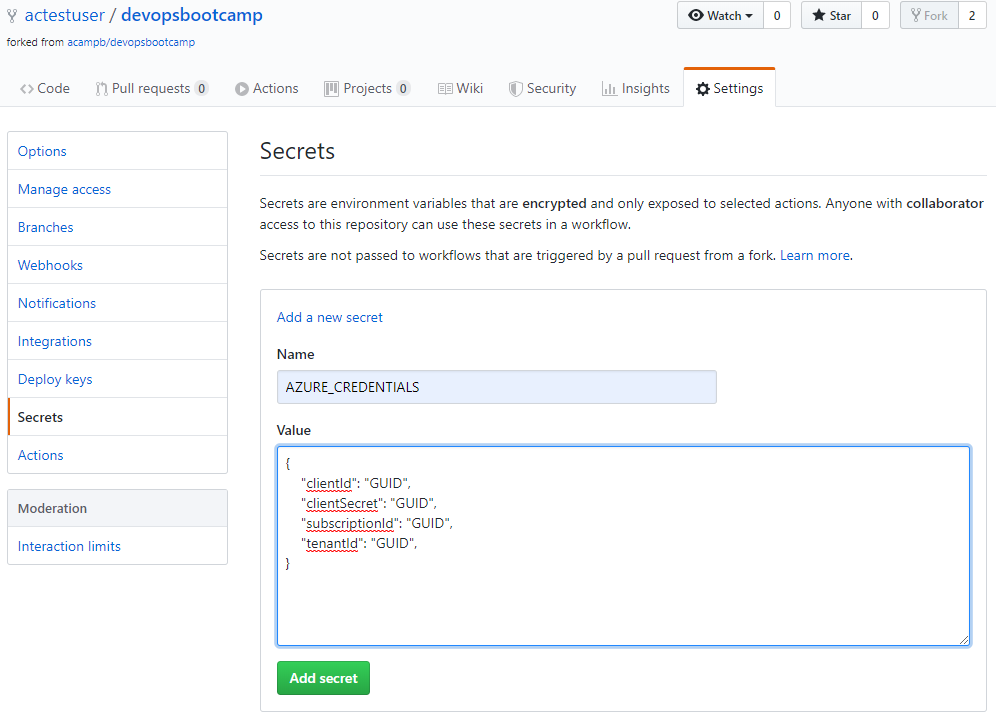

> Note: Once you add the secret you cannot retrieve the values in clear text from GitHub.

## Configure GitHub Actions

---

1. Browse to the `workflows-templates\lab_1_connectivity.yml` file and copy all of the text.

> 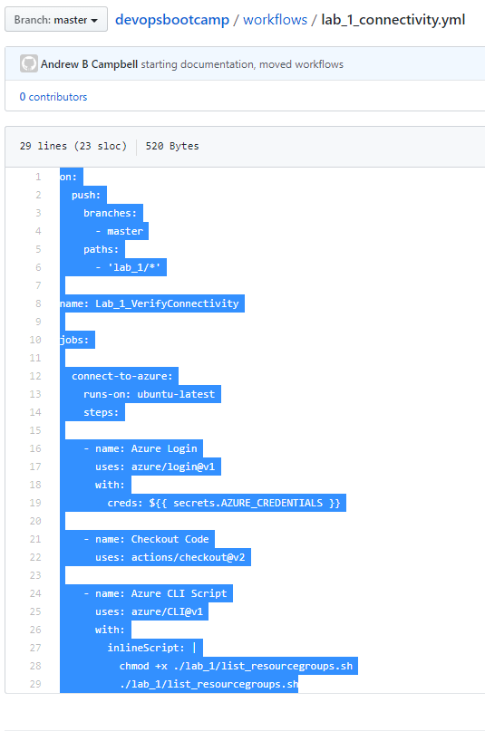

2. Navigate to **Actions** and click **Set up a workflow yourself**. If prompted to start with a sample workflow click the `Set up a workflow yourself` button in the top right.

> 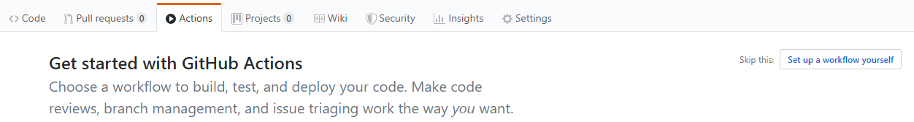

3. Replace all of the sample workflow code in the editor by pasting all the code you copied from `workflows-templates/lab_1_connectivity.yml`.

4. GitHub Actions files must be saved in a directory in your repo named `.github/workflows/`. The directory structure `.github/workflows/` should already exist in the path, name your workflow file `lab_1_connectivity.yml` and click `Start Commit`.

> 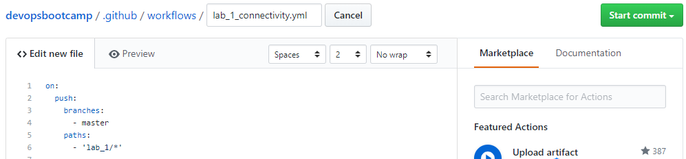

5. Add a short commit message and click `Commit new file`

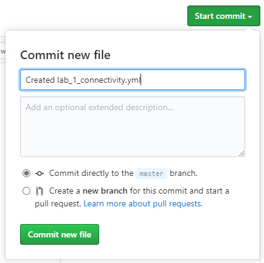

Navigate to **Code**, open the `.github/workflows` directory, and open the `lab_1_connectivity.yml` file. Let's explore this file.

The `on:` section describes what event will cause the workflow to execute. This code configures the workflow to only execute when files are modified in the `lab_1/` directory, and when the changes are pushed to the `master` branch.

```yaml
on:
  push:
    branches:
      - master
    paths:
      - "lab_1/**"
```

The `name:` section gives the workflow a name, visible in the `Actions` area of the repo. This code names the workflow `Lab_1_VerifyConnectivity`.

```yaml
name: Lab_1_VerifyConnectivity
```

The `jobs:` section instructs the workflow on what to actually do. Each job is made up of one or more steps that are executed sequentially. This code starts a single job named `connect-to-azure` running on a Ubuntu Linux instance. The job performs 3 steps:

- **Azure Login**: Login to Azure using the credentials stored in the secret `AZURE_CREDENTIALS`
- **Checkout Code**: This performs a `git clone` to copy all of the repo code into the Ubuntu Linux instance.
- **Azure CLI Script**: Execute the Azure CLI script `lab_1/list_resourcegroups.sh`

```yaml
jobs:
  connect-to-azure:
    runs-on: ubuntu-latest
    steps:
      - name: Azure Login
        uses: azure/login@v1
        with:
          creds: ${{ secrets.AZURE_CREDENTIALS }}

      - name: Checkout Code
        uses: actions/checkout@v2

      - name: Azure CLI Script
        uses: azure/CLI@v1
        with:
          inlineScript: |
            chmod +x ./lab_1/list_resourcegroups.sh
            ./lab_1/list_resourcegroups.sh
```

Navigate to the `lab_1/list_resourcegroups.sh` and we can examine what the script being executed by the action will actually do. We can see this script will simply show the account which is authenticated to Azure (this will be the service principal), and list the Resource Groups in the Azure subscription in a table format.

```python
# show the logged in account
az account show

# list all resource groups
az group list -o table
```

## Run GitHub Actions

The workflow we just created is triggered by changes made to the files in the `lab_1/` directory. Let's make a change here to kick off the workflow. The `readme.txt` can be modified by simply adding a new line or some text. The act of committing this change to the `master` branch will instruct GitHub Actions to kick off our workflow.

1. Navigate to **Code**, and browse to the `lab_1/readme.txt` file. Click the pencil icon to edit the file, and add a new line. Provide a commit message and commit your change.

2. Navigate to **Actions** and you should see your `Lab_1_VerifyConnectivity` workflow executing.

> 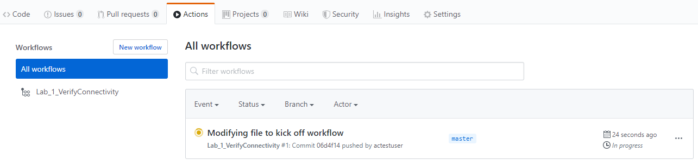

3. Click the instance of the workflow and you can explore the results of this execution. Within the `Lab_1_VerifyConnectivity` workflow you can click the `connect-to-azure` job. In the right-hand pane you can view the output of the individual steps (Azure Login, Checkout Code, Azure CLI Script) within this job.

> 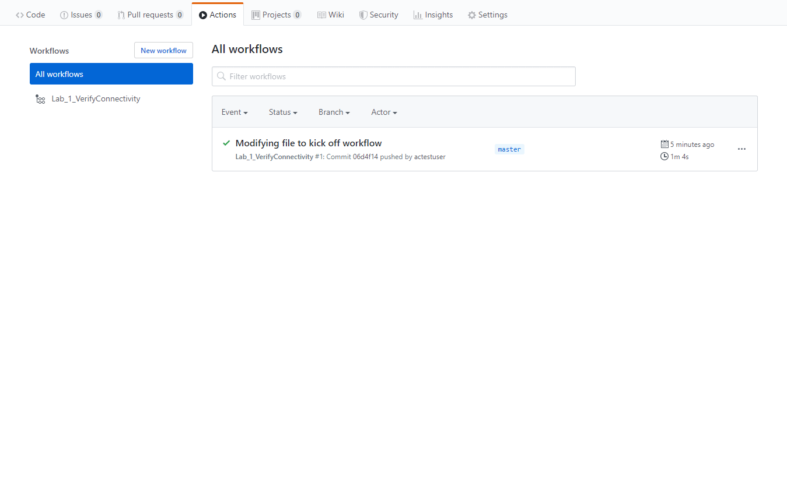

---

## End of Lab 1

Links to more learning:

- **Azure Cli**: [https://docs.microsoft.com/en-us/cli/azure/?view=azure-cli-latest](https://docs.microsoft.com/en-us/cli/azure/?view=azure-cli-latest)
- **GitHub Actions**: [https://help.github.com/en/actions/getting-started-with-github-actions/about-github-actions](https://help.github.com/en/actions/getting-started-with-github-actions/about-github-actions)
- **GitHub Actions Core Concepts**: [https://help.github.com/en/actions/getting-started-with-github-actions/core-concepts-for-github-actions](https://help.github.com/en/actions/getting-started-with-github-actions/about-github-actions)
- **Configuring a Workflow**: [https://help.github.com/en/actions/configuring-and-managing-workflows/configuring-a-workflow](https://help.github.com/en/actions/configuring-and-managing-workflows/configuring-a-workflow)


