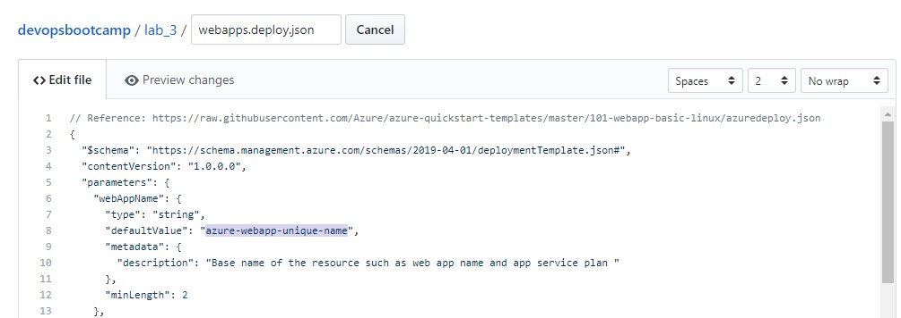
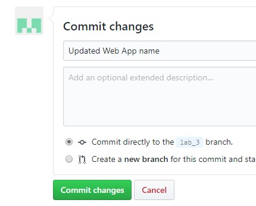
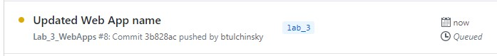

# Lab 3 - GitHub Actions

- [Create Azure Web App](#Create-Azure-Web-App)
- [Configure GitHub Actions](#Configure-GitHub-Actions)
- [Deploy Application to Azure with GitHub Actions](#Deploy-Application-to-Azure-with-GitHub-Actions)
- [Automate Application Re-Deployment of Changes](#Automate-Application-Re-Deployment-of-Changes)
<!-- - [Scale Out Resources](#Scale-Out-Resources)
- [Clean Up Resources](#Clean-Up-Resources) -->

---

## Overview

The third lab will deploy a NodeJS Web App using GitHub Actions.

> Note: Lab 3 uses the same secret `AZURE_CREDENTIALS` as in Lab 2

## Create Azure Web App

Create the Azure Web App that the pipeline will deploy to. Open Azure Cloud Shell and run the following PowerShell cmdlets:

1. Create the Resource Group `rg-lab-3`

```powershell
New-AzResourceGroup -Name 'rg-lab-3' -Location 'eastus2'
```

2. Create the Azure Web App

```powershell
New-AzResourceGroupDeployment -ResourceGroupName 'rg-lab-3' -TemplateUri https://raw.githubusercontent.com/softchoice-corp/DevOpsBootcamp/master/lab_3/webapps.deploy.json -Verbose
```

The ARM template deployment will create a unique name for the Web App and return it on the console under `Outputs`. Make a note of the `uniqueWebAppName` value, we will use it later to configure our GitHub Actions pipeline.

## Configure GitHub Actions

1. Browse to the `workflows-templates/lab_3_webapps.yaml` file and copy all of the text.

2. Navigate to **Actions** and click **New Workflow**. If prompted to start with a sample workflow click the `Set up a workflow yourself` button in the top right.

3. Replace all of the sample workflow code in the editor by pasting all the code you copied from `workflows-templates/lab_3_webapps.yaml`.

4. Modify the `AZURE_WEBAPP_NAME` variable to use the name of the Web App you created in the previous step.

```yaml
env:
  AZURE_WEBAPP_NAME: azure-webapp-unique-name
  AZURE_WEBAPP_PACKAGE_PATH: ./lab_3/app
```


5. GitHub Actions files must be saved in a directory in your repo named `.github/workflows/`. The directory structure `.github/workflows/` should already exist in the path, name your workflow file `lab_3_webapps.yaml` and click `Start Commit`.

6. Add a short commit message and click `Commit new file`.

7. We will also need to modify the ARM template for the Azure Web App resource creation to align with the unique name provided in the step 4.

   Navigate to **Code**, open `lab_3/` directory, and open `webapps.deploy.json` file.

   Update the `defaultValue` for the `webAppName` parameter to the unique name.

> 

8. Enter a commit message and click `Commit changes`.

> 

The last commit to change the Azure Web App name causes a run of the Actions.



## Deploy Application to Azure with GitHub Actions

## Automate Application Re-Deployment of Changes
