# Lab 3 - GitHub Actions

- [Create Azure Web App](#Create-Azure-Web-App)
- [Configure GitHub Actions](#Configure-GitHub-Actions)
- [Run GitHub Actions](#Run-GitHub-Actions)
- [Continuous Deployment of Changes](#Continuous-Deployment-of-Changes)
- [Unit Testing](#Unit-Testing)

---

## Overview

The third lab will deploy a NodeJS Web App using GitHub Actions.

> Note: Lab 3 uses the same secret `AZURE_CREDENTIALS` as in Lab 1

## Create Azure Web App

Create the Azure Web App that the pipeline will deploy to. Open Azure Cloud Shell and run the following PowerShell cmdlets:

1. Create the Resource Group `rg-lab-3`

```powershell
New-AzResourceGroup -Name 'rg-lab-3' -Location 'eastus2'
```

2. Create the Azure Web App

```powershell
New-AzResourceGroupDeployment -ResourceGroupName 'rg-lab-3' -TemplateUri https://raw.githubusercontent.com/softchoice-corp/DevOpsBootcamp/master/lab_3/webapps.deploy.json -Verbose
```

The ARM template deployment will create a unique name for the Web App and return it on the console under `Outputs`. Make a note of the `uniqueWebAppName` value, we will use it later to configure our GitHub Actions pipeline.

## Configure GitHub Actions

1. Browse to the `workflows-templates/lab_3_webapps.yaml` file and copy all of the text.

2. Navigate to **Actions** and click **New Workflow**. If prompted to start with a sample workflow click the `Set up a workflow yourself` button in the top right.

3. Replace all of the sample workflow code in the editor by pasting all the code you copied from `workflows-templates/lab_3_webapps.yaml`.

4. Modify the `AZURE_WEBAPP_NAME` variable to use the name of the Web App you created in the previous step.

```yaml
env:
  AZURE_WEBAPP_NAME: azure-webapp-unique-name
  AZURE_WEBAPP_PACKAGE_PATH: ./lab_3/app
```

5. GitHub Actions files must be saved in a directory in your repo named `.github/workflows/`. The directory structure `.github/workflows/` should already exist in the path, name your workflow file `lab_3_webapps.yaml` and click `Start Commit`.

6. Add a short commit message and click `Commit new file`.

---

## Run GitHub Actions

The workflow we just created is triggered by changes made to the files in the `lab_3/` directory. Let's make a change here to kick off the workflow. The `readme.txt` can be modified by simply adding a new line or some text. The act of committing this change to the `master` branch will instruct GitHub Actions to kick off our workflow.

1. Navigate to **Code**, and browse to the `lab_3/readme.txt` file. Click the pencil icon to edit the file, and add a new line. Provide a commit message and commit your change.

2. Navigate to **Actions** and you should see your `Lab_3_WebApp` workflow executing.

3. When the Workflow successfully finishes, Open up a browser and go to `<Azure Web App name>.azurewebsites.net`. Replace `<Azure Web App name>` with the unique name.

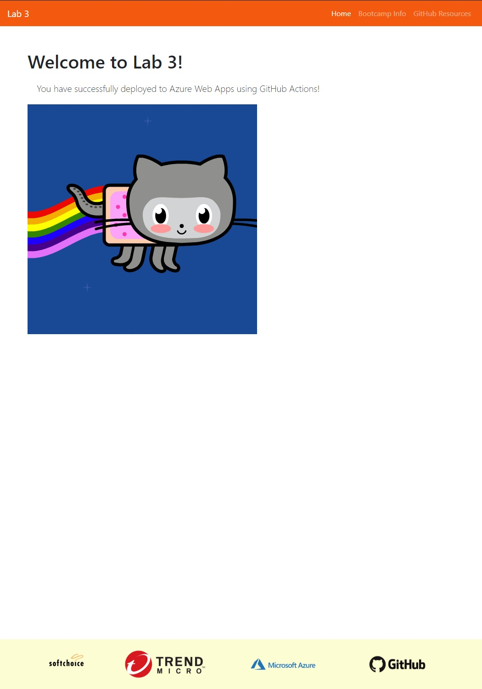

> Note: It is possible to find the URL in the Workflow's `Deploy to Azure WebApp` task's output

> 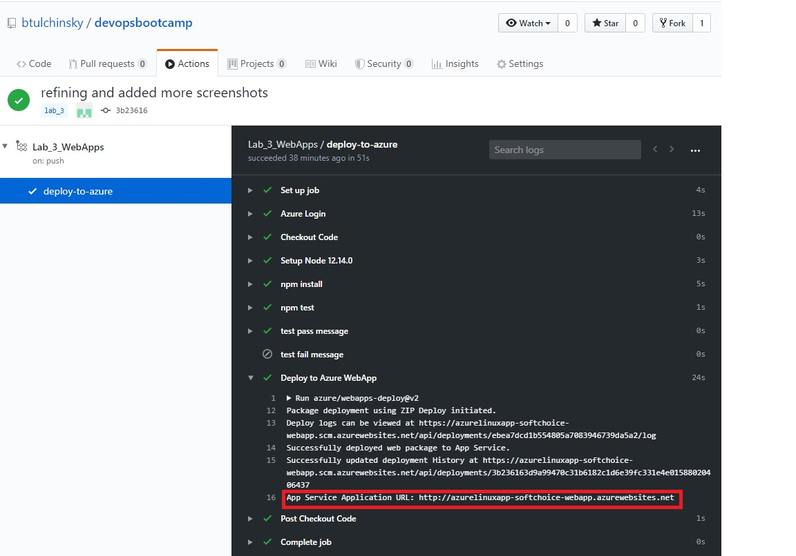

---

## Continuous Deployment of Changes

> GitHub provides an action on GitHub marketplace to simplify deployments to Azure Web App application called `webapps-deploy`. Go to [https://github.com/marketplace/actions/azure-webapp](https://github.com/marketplace/actions/azure-webapp) for more information.

1. Navigate to **Code**, open the `lab_3/app/public` directory and open the `index.html` file.

2. Find the Octodex image element (`img` tag) identified with the `id` attribute `octodex`.

> 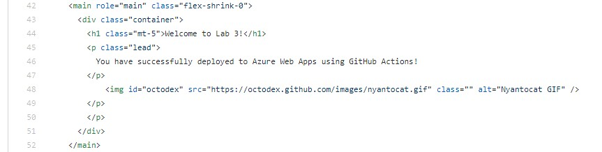

3. Go to [https://octodex.github.com/](https://octodex.github.com/) and copy the address of an Octodex that you like.

4. Update the `alt` and `src` attribute of the octodex `img` tag with description and copied address, respectively.

> 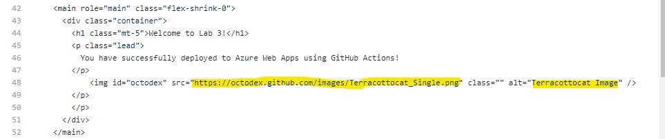

5. Enter a commit message and click `Commit changes`.

> 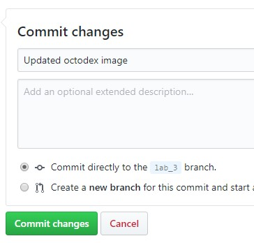

6. Navigate to **Actions** and observe the workflow.

> 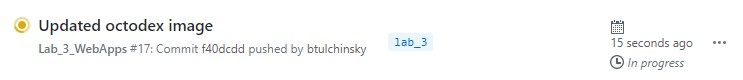

7. When the workflow finishes executing, open your browser and refresh or go to the `<Azure Web App name>.azurewebsites.net` website to observe the change in the application.

> 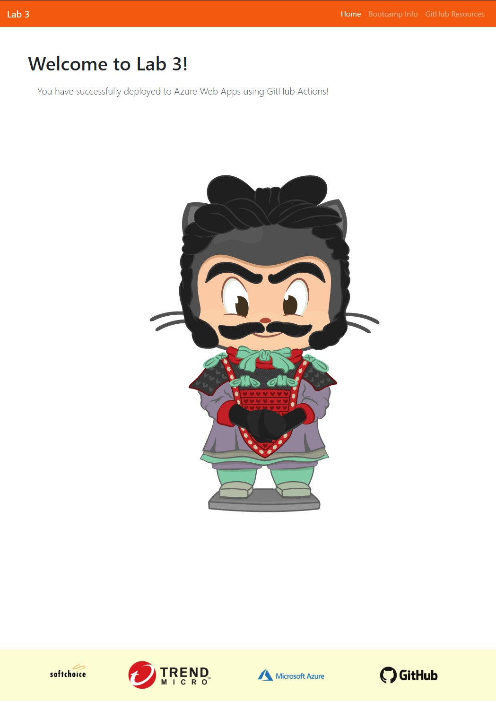

---

## Unit Testing

We have deployed our application successfully due to the defined unit tests passing successfully. We will now intentionally introduce an error into the application.

1. Navigate to **Code**, open the `lab_3/app/` directory and open the `index.js` file.

> 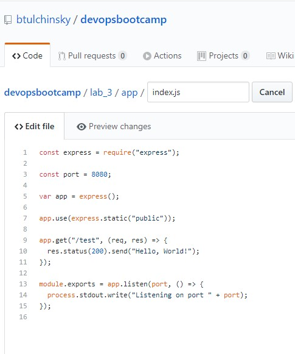

2. Change the `Hello, World!` text in the service `/path` response. It can be any misspelling or a completely different text, as long as it is different.

> 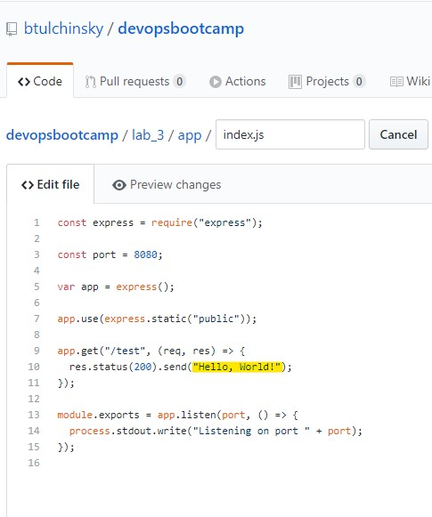

> 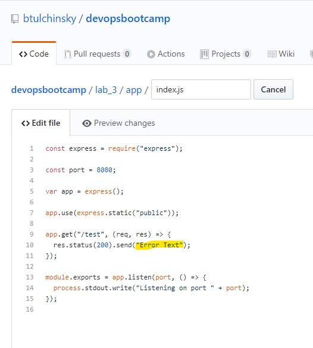

3. Enter a commit message and click `Commit changes`.

> 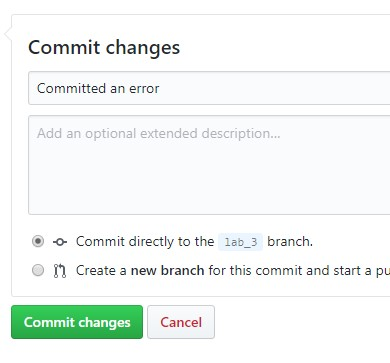

4. Navigate to **Actions** to observe the Workflow. Which will fail.

> 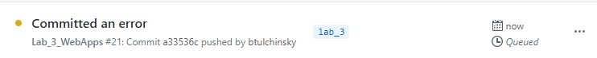

> 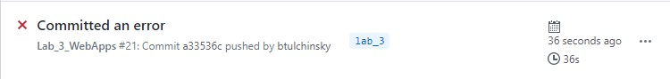

5. Click on the Workflow to take a look at the more granular tasks the Workflow is running and expand the `npm test` task.

> 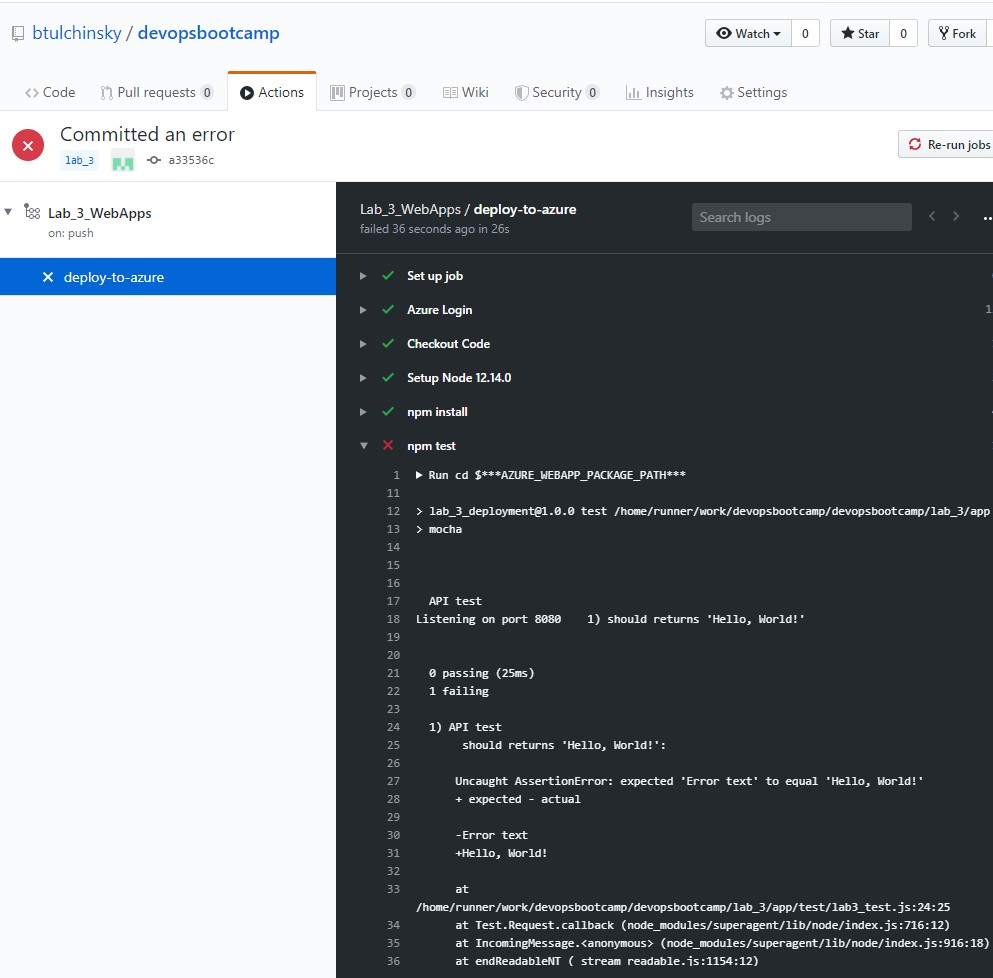

6. Notice that the `API test` unit test failed and the `Deploy to Azure WebApp` was skipped. This is the default behaviour when an error occurs and the workflow is in a failed state.

> 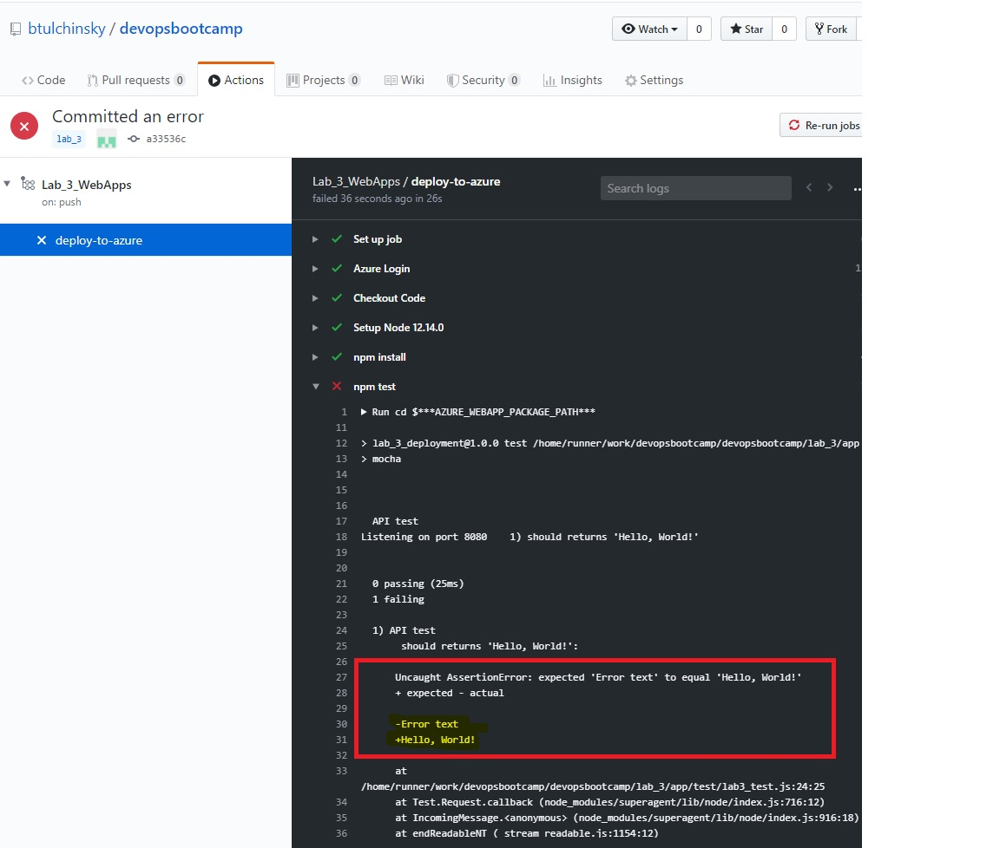

7. Notice that the `test pass message` was skipped, but the `test fail message` task did execute. This is because the `test fail message` has an `if` conditional execution on Workflow failure.

```yaml
- name: test fail message
  if: failure()
  run: |
    echo "npm tests failed! please check your code"
```

This demonstrates some of the flexibility of GitHub Action Workflows. Go to [https://help.github.com/en/actions/reference/workflow-syntax-for-github-actions](https://help.github.com/en/actions/reference/workflow-syntax-for-github-actions) for more information on other constructs and Workflow syntax.

8. Fix the Workflow by correcting the `lab_3/app/index.js` file with the proper text and commit the change.

---

## Clean Up Resources

To mimimize billing usage in your subscription we can remove all of the resources we deployed with GitHub Actions by deleting the Resource Group they are held in. From Azure Cloud Shell run the following command:

```python
az group delete --name rg-lab-3
```

## End of Lab 3

Links to more learning:

- **Azure App Service**: [https://docs.microsoft.com/en-us/azure/app-service/overview](https://docs.microsoft.com/en-us/azure/app-service/overview)
- **Node.js in Azure**: [https://docs.microsoft.com/en-us/azure/app-service/app-service-web-get-started-nodejs](https://docs.microsoft.com/en-us/azure/app-service/app-service-web-get-started-nodejs)
- **Unit Testing**: [https://en.wikipedia.org/wiki/Unit_testing](https://en.wikipedia.org/wiki/Unit_testing)


