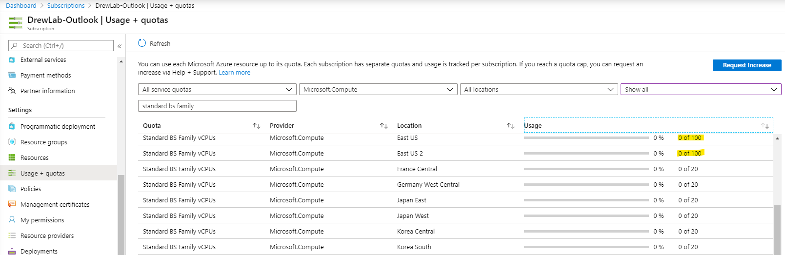

# Lab 4 - Deploy 75 Servers

- [Create ARM Template Deployment](#Create-ARM-Template-Deployment)

---

## Overview

The fourth lab is a demo of how we can quickly deploy 75 servers to Azure.

> Note: Executing the cmdlet's below will result in **75** Standard_B1s servers being deployed in your environment. If you have not requested a vCPU quota increase on your subscription for *Standard BS Family vCPUs* this will not complete successfully.

> 

## Create ARM Template Deployment

Create the Azure Resource Group for lab 4 and start an ARM Template Deployment from Azure Cloud Shell.

1. Create the Resource Group `rg-lab-4`

```powershell
New-AzResourceGroup -Name 'rg-lab-4' -Location 'eastus2'
```

2. Create the ARM Deployment

```powershell
New-AzResourceGroupDeployment -ResourceGroupName 'rg-lab-4' -TemplateUri https://raw.githubusercontent.com/softchoice-corp/DevOpsBootcamp/master/lab_4/75serversolution.deploy.json -Verbose
```

---

## Clean Up Resources

To mimimize billing usage in your subscription we can remove all of the resources we deployed with GitHub Actions by deleting the Resource Group they are held in. From Azure Cloud Shell run the following command:

```python
az group delete --name rg-lab-4
```

---

## End of Lab 4

